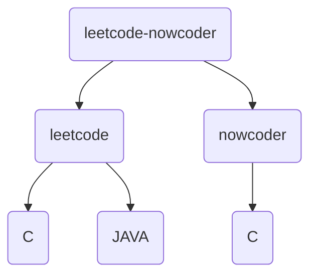

# 刷题

这里记录我开始接触 LeetCode 和 NowCoder 然后开始刷题的全过程。

## 1. 目录结构

## 2. LeetCode

### 阶段一：学习数据结构和算法（Lang:C）

简短的进行了一些的算法和部分的数据结构的学习并刷了部分题目，主要还是数据结构部分的学习顺序表、链表、栈、队列、二叉树以及常见的排序算法的学习和巩固同时熟悉 LeetCode 的 OJ 相关操作。

### 阶段三：刷代码随想录（Lang:JAVA）

这个阶段开始正式进入算法和数据结构的题目，同时依赖刷题掌握其他常用的算法和数据结构，最终能够适应大部分常见的算法题目。

## 3. NowCoder

### 阶段二：编程入门训练 （Lang:C）

这个阶段其实应该在阶段一之前的，但是无所谓，影响不大。这个阶段主要掌握语法、提高基础和增加自己的代码量，同时熟悉牛客的 OJ 提交、测试、判定等规则。
